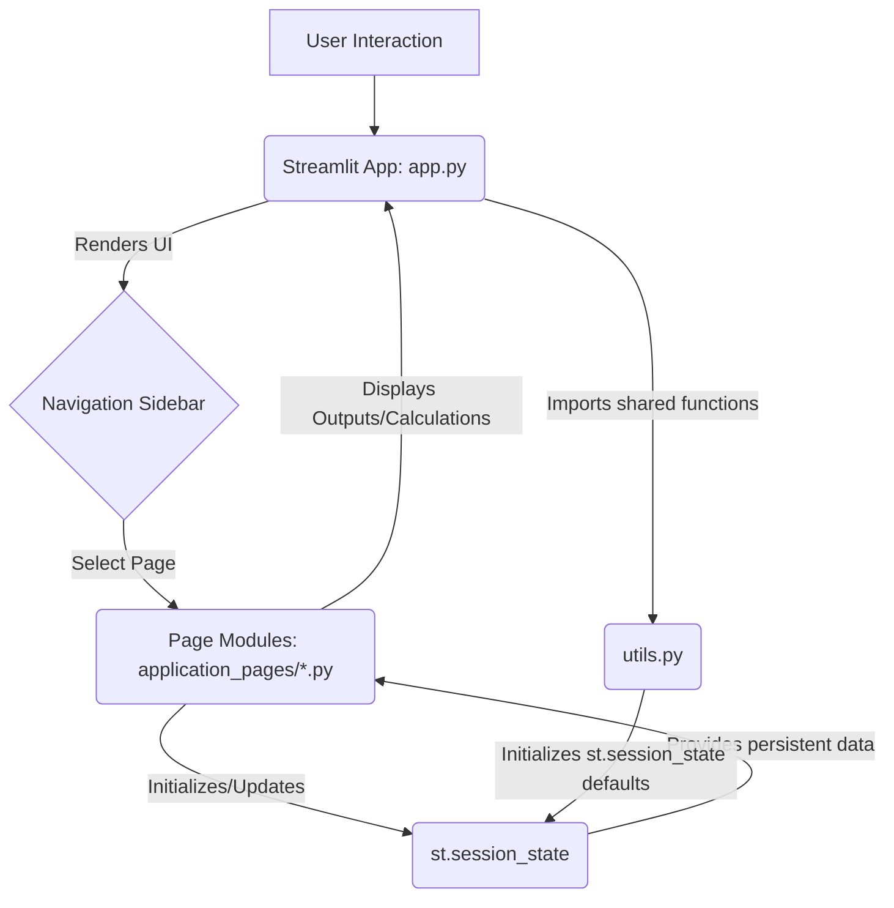

id: 69418ea2004610f57c077ffb_documentation
summary: Exit-Readiness AI Narrative & Valuation Impact Calculator Documentation
feedback link: https://docs.google.com/forms/d/e/1FAIpQLSfWkOK-in_bMMoHSZfcIvAeO58PAH9wrDqcxnJABHaxiDqhSA/viewform?usp=sf_link
environments: Web
status: Published
# QuLab: AI Exit-Readiness & Valuation Impact Calculator - Developer Guide

## 1. Introduction to QuLab and its Significance
Duration: 0:08:00

Welcome to this codelab on **QuLab: AI Exit-Readiness & Valuation Impact Calculator**. In today's dynamic M&A landscape, the integration and strategic articulation of Artificial Intelligence (AI) capabilities have become critical drivers of company valuation. This application empowers portfolio managers, like our persona Jane Doe from Alpha Capital, to systematically assess a company's AI maturity and quantify its potential impact on exit valuation.

### The Scenario: InnovateTech's Exit Strategy

Imagine **Jane Doe**, a Portfolio Manager at **Alpha Capital**, tasked with preparing her portfolio company, **InnovateTech**, for a successful exit. She understands that a strong AI narrative is not just a buzzword, but a tangible asset that can significantly uplift valuation. QuLab provides Jane with the tools to:

1.  **Systematically Assess InnovateTech's AI Capabilities**: Evaluate the company's AI across three crucial dimensions: **Visible**, **Documented**, and **Sustainable**.
2.  **Quantify AI Readiness**: Calculate a comprehensive **Exit-AI-R Score** by weighting these dimensions according to market priorities and InnovateTech's specific context.
3.  **Project Valuation Uplift**: Model the potential financial impact of this AI readiness on InnovateTech's EBITDA multiple, a key valuation metric.
4.  **Craft a Data-Driven Narrative**: Generate a persuasive report for potential strategic and financial buyers, leveraging the quantitative analysis performed within the application.

This application acts as an end-to-end guide, demonstrating how AI concepts and analytical tools can be applied to inform critical decisions regarding exit strategies and valuation.

<aside class="positive">
<b>Key Takeaway:</b> Understanding and articulating a company's AI capabilities is no longer a niche skill, but a core competency for maximizing enterprise value in M&A. QuLab provides a structured framework for this assessment.
</aside>

### Core Concepts Explained

*   **AI Exit-Readiness (Exit-AI-R)**: A holistic measure of how well a company's AI capabilities are positioned to drive value and appeal to potential acquirers. It considers both the current state and future potential of AI within the organization.
*   **AI Dimensions (Visible, Documented, Sustainable)**:
    *   **Visible AI**: Refers to AI applications and features that are evident to customers, users, or external stakeholders (e.g., AI-powered product features, intelligent automation visible in customer journeys).
    *   **Documented AI**: Encompasses the formal intellectual property, patents, research papers, internal documentation, and code repositories related to AI (e.g., proprietary algorithms, unique datasets, patents on AI methods).
    *   **Sustainable AI**: Pertains to the organizational infrastructure, talent, culture, and data pipelines that support the long-term development and maintenance of AI capabilities (e.g., dedicated AI teams, MLOps practices, ethical AI guidelines, continuous data acquisition strategies).
*   **EBITDA Multiple**: A common valuation metric used in M&A, calculated as Enterprise Value / Earnings Before Interest, Taxes, Depreciation, and Amortization. A higher multiple generally indicates a higher valuation.
*   **Valuation Uplift**: The increase in a company's valuation attributable to specific factors, in this case, a strong AI Exit-Readiness.

### Application Overview

The QuLab application is built using **Streamlit**, a Python library that simplifies the creation of web applications for data science and machine learning. It provides an interactive interface for users to input data, perform calculations, and visualize results.

The application's structure is modular, with a central `app.py` orchestrating navigation and importing functionality from separate page files in the `application_pages` directory. This modularity makes the application easy to understand, maintain, and extend.

```python
# app.py structure
import streamlit as st
import utils # For session state initialization and common functions

st.set_page_config(page_title="QuLab", layout="wide")
st.sidebar.image("https://www.quantuniversity.com/assets/img/logo5.jpg")
st.sidebar.divider()
st.title("QuLab: AI Exit-Readiness & Valuation Impact Calculator")
st.divider()

# ... (Introduction markdown) ...

# Sidebar for Reset button
with st.sidebar:
    st.header("Control Panel")
    if st.button("Reset Application"):
        st.session_state.clear()
        st.rerun()

st.sidebar.divider()

# Navigation using selectbox
page = st.sidebar.selectbox(
    label="Navigation",
    options=[
        "1. Setup and Introduction",
        "2. Assess AI Dimensions",
        "3. Calculate Exit-AI-R Score",
        "4. Project Valuation Uplift",
        "5. Craft AI Exit Narrative"
    ]
)

# Page routing logic
if page == "1. Setup and Introduction":
    from application_pages.page_1_setup import main
    main()
elif page == "2. Assess AI Dimensions":
    from application_pages.page_2_assess_dimensions import main
    main()
# ... (other page imports) ...

st.markdown("")
st.caption("This application helps portfolio managers quantify and articulate the value of AI in portfolio companies for exit strategies.")
```

To run this application, you would typically have a file structure like this:

```
quLab/
├── app.py
├── utils.py
└── application_pages/
    ├── __init__.py
    ├── page_1_setup.py
    ├── page_2_assess_dimensions.py
    ├── page_3_calculate_score.py
    ├── page_4_project_valuation.py
    └── page_5_craft_narrative.py
```

Assuming you have `streamlit` installed, navigate to the `quLab` directory in your terminal and run:

```console
streamlit run app.py
```

This will launch the application in your web browser.

## 2. Understanding the Application Architecture
Duration: 0:10:00

The QuLab application follows a clear, modular architecture designed for Streamlit. This approach ensures that the application is scalable, maintainable, and easy to navigate.

### Core Architectural Components

1.  **`app.py` (Main Orchestrator)**:
    *   Sets up the Streamlit page configuration (`st.set_page_config`).
    *   Displays the application title and introductory markdown.
    *   Manages the global `st.session_state` (e.g., the "Reset Application" button).
    *   Provides the main navigation sidebar (`st.sidebar.selectbox`).
    *   Dynamically imports and calls the `main()` function of the selected page module.

2.  **`utils.py` (Shared Utilities)**:
    *   This module is crucial for initializing and managing the Streamlit `st.session_state`.
    *   It likely contains functions to set default values for variables that need to persist across different pages of the application.
    *   It could also house common helper functions or data loading logic used by multiple pages.

3.  **`application_pages/` (Page Modules)**:
    *   Each file within this directory (`page_1_setup.py`, `page_2_assess_dimensions.py`, etc.) represents a distinct step or page in the application's workflow.
    *   Each page module is expected to have a `main()` function, which Streamlit calls to render the content of that specific page.
    *   These modules encapsulate the UI components (inputs, displays), calculations, and specific logic relevant to their respective steps.

### Application Flow Diagram

The following diagram illustrates the high-level architecture and data flow within the QuLab application:



**Explanation of the Flow:**

1.  **User Interaction**: The user interacts with the Streamlit UI, primarily through the sidebar navigation.
2.  **`app.py` (Orchestrator)**: `app.py` is the entry point. It sets up the overall layout and handles global controls like the "Reset" button.
3.  **Navigation Sidebar**: The `st.sidebar.selectbox` allows the user to choose which functional page to view.
4.  **Page Modules**: Based on the selected page, `app.py` imports the corresponding module (e.g., `page_2_assess_dimensions.py`) and calls its `main()` function.
5.  **`st.session_state`**: This is Streamlit's mechanism for storing variables that persist across reruns and page changes. Each page will read from and write to `st.session_state` to share data. `utils.py` often plays a key role in ensuring `st.session_state` is properly initialized with default values when the application first starts or is reset.
6.  **`utils.py`**: Contains shared logic, including functions to initialize `st.session_state` variables if they don't already exist. This prevents errors when pages try to access non-existent keys in the session state.

### `st.session_state` Management

A crucial aspect of multi-page Streamlit applications is state management. Since Streamlit reruns the entire script on every interaction, `st.session_state` is used to maintain variables across these reruns and across different selected pages.

**Example of `utils.py` for session state initialization (conceptual):**

```python
# utils.py
def initialize_session_state():
    if "company_name" not in st.session_state:
        st.session_state.company_name = "InnovateTech"
    if "ai_visible_score" not in st.session_state:
        st.session_state.ai_visible_score = 50 # Default score
    if "dimension_weights" not in st.session_state:
        st.session_state.dimension_weights = {"visible": 0.33, "documented": 0.33, "sustainable": 0.34}
    # ... and so on for all variables needed across pages

# In app.py or in each page's main() function:
# utils.initialize_session_state()
```

<aside class="negative">
<b>Warning:</b> Failing to properly initialize `st.session_state` can lead to `KeyError` exceptions when a page attempts to access a variable that hasn't been set yet. Always check for existence (`if "key" not in st.session_state:`) before setting defaults.
</aside>

## 3. Setup and Introduction Page (`page_1_setup.py`)
Duration: 0:05:00

This is the first functional page a user encounters, beyond the main `app.py` introduction. Its primary purpose is to introduce the specific scenario (InnovateTech) and allow for initial setup, such as defining the company name or setting some baseline parameters that will be used throughout the application.

### Page Purpose

The `page_1_setup.py` module serves as a soft entry point after the main application introduction. It likely allows users to:
*   Confirm or input the company name being analyzed.
*   Potentially set initial context or assumptions.
*   Reiterate the value proposition and the journey the user is about to undertake.

### Expected Functionality

```python
# application_pages/page_1_setup.py (conceptual)
import streamlit as st
import utils # Assuming utils has the state initialization

def main():
    utils.initialize_session_state() # Ensure session state is ready

    st.header("1. Setup and Introduction")
    st.markdown("""
    Welcome to the QuLab analysis for **InnovateTech**! This section sets the stage for our comprehensive AI exit-readiness and valuation impact assessment.
    """)

    # Allow user to input/confirm the company name
    st.session_state.company_name = st.text_input(
        "Company Name for Analysis",
        value=st.session_state.get("company_name", "InnovateTech"),
        help="Enter the name of the portfolio company you are analyzing."
    )

    st.info(f"You are currently analyzing: **{st.session_state.company_name}**")

    st.markdown("""
    <aside class="positive">
    <b>Objective:</b> Over the next few steps, we will systematically evaluate <b>InnovateTech's</b> AI capabilities, quantify its AI readiness score, project potential valuation uplifts, and finally, craft a compelling AI exit narrative.
    </aside>
    """)

    st.subheader("What to Expect:")
    st.markdown("""
    *   **Assess AI Dimensions**: You will score the company across Visible, Documented, and Sustainable AI aspects.
    *   **Calculate Exit-AI-R Score**: These scores will be weighted and aggregated into a single AI Readiness Score.
    *   **Project Valuation Uplift**: We will model how this score translates into an uplift in the company's EBITDA multiple.
    *   **Craft AI Exit Narrative**: Finally, all insights will be compiled into a persuasive report.
    """)
```

### Key Concepts from this Page

*   **User Input and `st.text_input`**: Demonstrates how to get basic text input from the user.
*   **`st.session_state.get()`**: A safe way to retrieve values from `st.session_state` with a fallback default, preventing errors if the key doesn't exist yet.
*   **Context Setting**: Crucial for guiding the user through the application's workflow.

## 4. Assess AI Dimensions (`page_2_assess_dimensions.py`)
Duration: 0:15:00

This page is where the core qualitative and quantitative assessment of the company's AI capabilities begins. Users will evaluate the company across the three predefined AI dimensions: Visible, Documented, and Sustainable.

### Page Purpose

The `page_2_assess_dimensions.py` module facilitates the detailed evaluation of InnovateTech's AI capabilities. It aims to gather scores and potentially qualitative descriptions for each dimension, which will then feed into the Exit-AI-R Score calculation.

### Key Concepts

*   **Multi-Dimensional Assessment**: Breaking down a complex concept (AI readiness) into measurable, actionable dimensions.
*   **Qualitative and Quantitative Input**: Combining subjective scoring (e.g., via sliders) with descriptive text.
*   **`st.slider`**: A Streamlit widget ideal for gathering scores within a defined range.
*   **`st.text_area`**: For allowing detailed qualitative descriptions.

### Expected Functionality

Users will likely interact with input fields (e.g., sliders) to assign a score (e.g., from 0 to 100) for each AI dimension. They might also provide brief descriptions or justifications for their scores.

```python
# application_pages/page_2_assess_dimensions.py (conceptual)
import streamlit as st
import utils

def main():
    utils.initialize_session_state()

    st.header("2. Assess AI Dimensions")
    st.markdown(f"""
    Evaluate **{st.session_state.company_name}'s** AI capabilities across the three critical dimensions.
    Provide a score (0-100) and a brief justification for each.
    """)

    # Visible AI
    st.subheader("Visible AI Capabilities")
    st.markdown("""
    How evident are **InnovateTech's** AI applications and features to customers, users, or external stakeholders?
    Consider customer-facing AI products, intelligent automation impacting user experience, etc.
    """)
    st.session_state.ai_visible_score = st.slider(
        "Visible AI Score", 0, 100,
        value=st.session_state.get("ai_visible_score", 50),
        help="Score 0-100 based on the visibility of AI to external parties."
    )
    st.session_state.ai_visible_desc = st.text_area(
        "Description for Visible AI",
        value=st.session_state.get("ai_visible_desc", "InnovateTech has launched several AI-powered features in its core product, leading to improved user engagement."),
        height=100
    )

    st.divider()

    # Documented AI
    st.subheader("Documented AI Capabilities")
    st.markdown("""
    What formal intellectual property, patents, research, and internal documentation exist around **InnovateTech's** AI?
    Think about proprietary algorithms, unique datasets, academic publications, etc.
    """)
    st.session_state.ai_documented_score = st.slider(
        "Documented AI Score", 0, 100,
        value=st.session_state.get("ai_documented_score", 40),
        help="Score 0-100 based on the formal documentation and IP around AI."
    )
    st.session_state.ai_documented_desc = st.text_area(
        "Description for Documented AI",
        value=st.session_state.get("ai_documented_desc", "InnovateTech holds 3 patents related to its core AI models and has a robust internal knowledge base for its ML stack."),
        height=100
    )

    st.divider()

    # Sustainable AI
    st.subheader("Sustainable AI Capabilities")
    st.markdown("""
    How robust are **InnovateTech's** organizational infrastructure, talent, culture, and data pipelines for long-term AI development and maintenance?
    Consider dedicated AI teams, MLOps, ethical AI frameworks, data governance, and continuous data acquisition.
    """)
    st.session_state.ai_sustainable_score = st.slider(
        "Sustainable AI Score", 0, 100,
        value=st.session_state.get("ai_sustainable_score", 60),
        help="Score 0-100 based on the sustainability and robustness of AI operations."
    )
    st.session_state.ai_sustainable_desc = st.text_area(
        "Description for Sustainable AI",
        value=st.session_state.get("ai_sustainable_desc", "InnovateTech has a dedicated AI research team, a clear MLOps strategy, and strong data governance policies."),
        height=100
    )

    st.divider()

    st.success("AI Dimension scores updated in session state. Proceed to the next step to calculate the Exit-AI-R Score.")

    <aside class="positive">
    <b>Best Practice:</b> Encourage users to be as objective as possible and provide concise, data-backed justifications. These descriptions will be invaluable when crafting the final narrative.
    </aside>
```

## 5. Calculate Exit-AI-R Score (`page_3_calculate_score.py`)
Duration: 0:15:00

With the individual AI dimension scores in hand, this page focuses on synthesizing these inputs into a single, comprehensive **Exit-AI-R Score**. This involves assigning weights to each dimension, allowing the user to reflect the relative importance of Visible, Documented, and Sustainable AI for their specific context or market.

### Page Purpose

The `page_3_calculate_score.py` module's primary function is to:
*   Display the previously entered dimension scores.
*   Allow the user to adjust weighting factors for each dimension.
*   Calculate the final Exit-AI-R Score based on these weighted inputs.
*   Potentially visualize the contribution of each dimension to the overall score.

### Key Concepts

*   **Weighted Average**: A fundamental statistical concept used to give different importance to different data points.
    $ \text{Exit-AI-R Score} = (\text{Visible Score} \times \text{Visible Weight}) + (\text{Documented Score} \times \text{Documented Weight}) + (\text{Sustainable Score} \times \text{Sustainable Weight}) $
*   **Market Prioritization**: The ability to adjust weights reflects that different market segments or buyer types might prioritize certain AI aspects over others (e.g., a strategic buyer might value Sustainable AI higher, while a financial buyer might focus on Visible AI for immediate revenue impact).
*   **`st.columns`**: Streamlit layout tool for arranging widgets side-by-side, useful for inputting weights and displaying scores.

### Expected Functionality

The user will see their scores from the previous page. They will then use sliders or number inputs to define the percentage weight for each dimension, ensuring the total weight sums to 100%. The application will dynamically calculate and display the Exit-AI-R Score.

```python
# application_pages/page_3_calculate_score.py (conceptual)
import streamlit as st
import utils

def main():
    utils.initialize_session_state()

    st.header("3. Calculate Exit-AI-R Score")
    st.markdown(f"""
    Now, let's aggregate **{st.session_state.company_name}'s** AI dimension scores into a single **Exit-AI-R Score**.
    Adjust the weights below to reflect the relative importance of each dimension for your specific exit strategy.
    """)

    st.subheader("Dimension Scores")
    col1, col2, col3 = st.columns(3)
    with col1:
        st.metric("Visible AI Score", f"{st.session_state.get('ai_visible_score', 0)}/100")
    with col2:
        st.metric("Documented AI Score", f"{st.session_state.get('ai_documented_score', 0)}/100")
    with col3:
        st.metric("Sustainable AI Score", f"{st.session_state.get('ai_sustainable_score', 0)}/100")

    st.subheader("Adjust Dimension Weights (Total must sum to 100%)")

    # Get initial weights or set defaults
    weights = st.session_state.get("dimension_weights", {"visible": 0.33, "documented": 0.33, "sustainable": 0.34})

    w_visible = st.slider("Weight for Visible AI (%)", 0, 100, int(weights["visible"] * 100))
    w_documented = st.slider("Weight for Documented AI (%)", 0, 100, int(weights["documented"] * 100))
    w_sustainable = st.slider("Weight for Sustainable AI (%)", 0, 100, int(weights["sustainable"] * 100))

    # Normalize weights to ensure they sum to 100%
    total_weight = w_visible + w_documented + w_sustainable
    if total_weight != 0:
        w_visible_norm = w_visible / total_weight
        w_documented_norm = w_documented / total_weight
        w_sustainable_norm = w_sustainable / total_weight
    else: # Avoid division by zero if all weights are 0
        w_visible_norm = w_documented_norm = w_sustainable_norm = 0

    st.session_state.dimension_weights = {
        "visible": w_visible_norm,
        "documented": w_documented_norm,
        "sustainable": w_sustainable_norm,
    }

    st.info(f"Current Total Weight: {total_weight}% (Normalized for calculation)")

    # Calculate Exit-AI-R Score
    ai_score = (st.session_state.get("ai_visible_score", 0) * w_visible_norm +
                st.session_state.get("ai_documented_score", 0) * w_documented_norm +
                st.session_state.get("ai_sustainable_score", 0) * w_sustainable_norm)

    st.session_state.exit_ai_r_score = round(ai_score, 2)

    st.divider()
    st.markdown(f"## Calculated Exit-AI-R Score: **{st.session_state.exit_ai_r_score} / 100**")

    <aside class="positive">
    <b>Tip:</b> Experiment with different weightings to understand how market priorities (e.g., favoring IP vs. customer-facing features) can impact the overall AI readiness perception.
    </aside>
```

## 6. Project Valuation Uplift (`page_4_project_valuation.py`)
Duration: 0:20:00

This is where the quantitative AI readiness score translates into tangible financial impact. This page projects how the calculated Exit-AI-R Score can influence a company's valuation, specifically through its EBITDA multiple.

### Page Purpose

The `page_4_project_valuation.py` module focuses on financial modeling. It will:
*   Take the calculated Exit-AI-R Score from the previous step.
*   Allow users to input key financial metrics (e.g., current EBITDA, base industry multiple).
*   Model a relationship between AI readiness and an uplift in the EBITDA multiple.
*   Display the projected valuation uplift and the new enterprise value.
*   Potentially offer sensitivity analysis or scenario planning.

### Key Concepts

*   **EBITDA Multiple Valuation**: A common method where Enterprise Value = EBITDA $\times$ Multiple.
*   **AI-driven Multiple Expansion**: The hypothesis that companies with stronger AI capabilities command higher valuation multiples due to perceived advantages like innovation, efficiency, competitive moat, and future growth potential.
*   **Sensitivity Analysis**: Exploring how changes in input variables (e.g., uplift factor, base multiple) affect the final outcome.
*   **`st.number_input`**: For numerical inputs like financial figures.
*   **`st.bar_chart` or `st.line_chart`**: For visualizing the valuation impact.

### Expected Functionality

Users will input InnovateTech's current EBITDA and a benchmark industry EBITDA multiple. The application will then apply a predefined or user-adjustable "AI uplift factor" based on the Exit-AI-R Score to calculate a new, higher EBITDA multiple and the corresponding enterprise value.

```python
# application_pages/page_4_project_valuation.py (conceptual)
import streamlit as st
import utils
import pandas as pd
import numpy as np

def main():
    utils.initialize_session_state()

    st.header("4. Project Valuation Uplift")
    st.markdown(f"""
    Let's quantify the potential financial impact of **{st.session_state.company_name}'s** Exit-AI-R Score on its valuation.
    We will model the uplift in EBITDA multiple driven by strong AI readiness.
    """)

    exit_ai_r_score = st.session_state.get("exit_ai_r_score", 0)
    st.metric("Current Exit-AI-R Score", f"{exit_ai_r_score} / 100")

    st.subheader("Financial Inputs")
    col1, col2 = st.columns(2)
    with col1:
        st.session_state.current_ebitda = st.number_input(
            "Current LTM EBITDA ($M)",
            min_value=0.0, value=st.session_state.get("current_ebitda", 50.0), step=5.0,
            help="InnovateTech's latest twelve months EBITDA in millions of dollars."
        )
    with col2:
        st.session_state.base_ebitda_multiple = st.number_input(
            "Base Industry EBITDA Multiple",
            min_value=1.0, value=st.session_state.get("base_ebitda_multiple", 10.0), step=0.5,
            help="Typical EBITDA multiple for comparable companies in InnovateTech's industry without significant AI differentiation."
        )

    st.subheader("AI Impact Modeling")
    st.markdown("""
    The AI Exit-Readiness Score will translate into an uplift factor for the EBITDA multiple.
    """)

    # Simple linear relationship for demonstration
    # You might have a more complex model (e.g., S-curve, lookup table) in a real application
    ai_uplift_factor_per_point = st.number_input(
        "AI Uplift Factor per Score Point (%)",
        min_value=0.0, max_value=0.5, value=st.session_state.get("ai_uplift_factor_per_point", 0.05), step=0.01,
        help="Percentage increase in EBITDA multiple for every point in Exit-AI-R Score."
    ) / 100 # Convert to decimal

    # Calculate AI-driven multiple uplift
    ai_multiple_uplift_percentage = exit_ai_r_score * ai_uplift_factor_per_point
    new_ebitda_multiple = st.session_state.base_ebitda_multiple * (1 + ai_multiple_uplift_percentage)
    valuation_uplift_absolute = (new_ebitda_multiple - st.session_state.base_ebitda_multiple) * st.session_state.current_ebitda

    st.divider()

    st.markdown(f"### Projected AI-Enhanced Valuation for {st.session_state.company_name}")

    col_res1, col_res2, col_res3 = st.columns(3)
    with col_res1:
        st.metric("Base Enterprise Value ($M)", f"${st.session_state.current_ebitda * st.session_state.base_ebitda_multiple:,.2f}")
    with col_res2:
        st.metric("New EBITDA Multiple", f"{new_ebitda_multiple:,.2f}x")
    with col_res3:
        st.metric("New Enterprise Value ($M)", f"${st.session_state.current_ebitda * new_ebitda_multiple:,.2f}")

    st.success(f"Potential Valuation Uplift from AI: **${valuation_uplift_absolute:,.2f}M**")

    # Visualization
    st.subheader("Valuation Impact Visualization")
    data = pd.DataFrame({
        'Category': ['Base Valuation', 'AI-Enhanced Valuation'],
        'Value ($M)': [st.session_state.current_ebitda * st.session_state.base_ebitda_multiple, st.session_state.current_ebitda * new_ebitda_multiple]
    })
    st.bar_chart(data.set_index('Category'))

    st.session_state.projected_new_multiple = new_ebitda_multiple
    st.session_state.valuation_uplift_amount = valuation_uplift_absolute

    <aside class="negative">
    <b>Caution:</b> The AI uplift factor is a simplified model for demonstration. In real-world scenarios, this relationship would be derived from rigorous market research, comparable transaction analysis, and expert judgment.
    </aside>
```

## 7. Craft AI Exit Narrative (`page_5_craft_narrative.py`)
Duration: 0:15:00

The final step in QuLab is to synthesize all the gathered insights, scores, and financial projections into a coherent and persuasive narrative. This report is crucial for communicating the value of AI to potential buyers.

### Page Purpose

The `page_5_craft_narrative.py` module is responsible for generating a comprehensive report based on all previous inputs and calculations. It pulls data from `st.session_state` to construct a compelling story about InnovateTech's AI capabilities and their impact on valuation.

### Key Concepts

*   **Data-Driven Storytelling**: Transforming raw data and scores into a persuasive narrative.
*   **Executive Summary Generation**: Automatically compiling key findings.
*   **Dynamic Content Generation**: Using f-strings or Markdown formatting to embed variables directly into the report.
*   **Report Structure**: A logical flow from assessment to financial impact to strategic implications.
*   **`st.download_button`**: For allowing users to download the generated report (e.g., as a Markdown file or PDF).

### Expected Functionality

This page will display a pre-formatted report that dynamically includes the company name, individual AI dimension scores and descriptions, the calculated Exit-AI-R Score, and the projected valuation uplift. Users can review this narrative and potentially download it.

```python
# application_pages/page_5_craft_narrative.py (conceptual)
import streamlit as st
import utils

def main():
    utils.initialize_session_state()

    st.header("5. Craft AI Exit Narrative")
    st.markdown(f"""
    Here is the comprehensive AI Exit Narrative for **{st.session_state.get('company_name', 'InnovateTech')}**,
    generated from your assessments and projections. This report is designed to articulate the value of AI
    to strategic and financial buyers.
    """)

    company_name = st.session_state.get('company_name', 'InnovateTech')
    exit_ai_r_score = st.session_state.get('exit_ai_r_score', 0)
    valuation_uplift = st.session_state.get('valuation_uplift_amount', 0.0)
    base_ebitda_multiple = st.session_state.get('base_ebitda_multiple', 0.0)
    projected_new_multiple = st.session_state.get('projected_new_multiple', 0.0)

    report_content = f"""
# AI Exit-Readiness & Valuation Impact Report: {company_name}

## Executive Summary

**{company_name}** demonstrates a strong AI Exit-Readiness with a calculated **Exit-AI-R Score of {exit_ai_r_score}/100**. This robust positioning in AI is projected to drive a significant valuation uplift, transforming a base industry EBITDA multiple of {base_ebitda_multiple:.2f}x to an AI-enhanced multiple of **{projected_new_multiple:.2f}x**, representing a potential **${valuation_uplift:,.2f}M** increase in enterprise value. This report details the specific AI capabilities contributing to this value.

## 1. AI Capability Assessment

### Visible AI Capabilities
**Score: {st.session_state.get('ai_visible_score', 0)}/100**
**Description:** {st.session_state.get('ai_visible_desc', 'No description provided.')}

### Documented AI Capabilities
**Score: {st.session_state.get('ai_documented_score', 0)}/100**
**Description:** {st.session_state.get('ai_documented_desc', 'No description provided.')}

### Sustainable AI Capabilities
**Score: {st.session_state.get('ai_sustainable_score', 0)}/100**
**Description:** {st.session_state.get('ai_sustainable_desc', 'No description provided.')}

## 2. Exit-AI-R Score Analysis

**Total Exit-AI-R Score: {exit_ai_r_score}/100**

The Exit-AI-R score is derived from a weighted average of the assessed dimensions, reflecting market priorities. This score indicates {company_name}'s overall maturity and strategic positioning in AI, making it an attractive target for acquirers seeking AI-driven growth and innovation.

## 3. Projected Valuation Impact

Based on its strong Exit-AI-R Score, **{company_name}** is expected to command a premium multiple in an M&A transaction.
*   **Current LTM EBITDA:** ${st.session_state.get('current_ebitda', 0.0):,.2f}M
*   **Base Industry EBITDA Multiple:** {base_ebitda_multiple:.2f}x
*   **AI-Enhanced EBITDA Multiple:** {projected_new_multiple:.2f}x
*   **Potential Valuation Uplift from AI:** **${valuation_uplift:,.2f}M**

This uplift underscores how {company_name}'s strategic investment and execution in AI directly enhance its enterprise value, providing a compelling narrative for potential investors and buyers.

## 4. Strategic Implications for Acquirers

{company_name}'s robust AI capabilities offer acquirers significant strategic advantages, including:
*   **Accelerated Innovation**: Rapid integration of advanced AI functionalities.
*   **Competitive Differentiation**: Strengthening market position with unique AI-powered offerings.
*   **Operational Efficiency**: Leveraging AI for cost savings and process optimization.
*   **Talent Acquisition**: Inheriting a skilled AI team and established R&D culture.

This report serves as a foundational document for engaging with potential buyers and articulating the full extent of {company_name}'s AI-driven value proposition.
"""
    st.markdown(report_content)

    # Download Button
    st.divider()
    <button>
      [Download AI Exit Narrative](data:text/markdown;base64,{
          import base64
          b64 = base64.b64encode(report_content.encode()).decode()
          print(b64)
      })
    </button>
    <aside class="positive">
    <b>Developer Note:</b> The `data:text/markdown;base64,...` syntax is used to create an immediate download link for dynamically generated content directly within the browser.
    </aside>
```

## 8. Extending and Customizing QuLab
Duration: 0:10:00

QuLab provides a solid framework for AI exit-readiness assessment. This section offers ideas on how developers can extend its functionality and customize it for different use cases.

### Best Practices for Extension

*   **Modularity**: Maintain the separation of concerns by keeping page logic in individual files within `application_pages/`.
*   **`st.session_state` Management**: Centralize session state initialization in `utils.py` and ensure all pages handle missing keys gracefully (e.g., using `st.session_state.get('key', default_value)`).
*   **Configuration**: For more complex applications, consider using a separate configuration file (e.g., `config.py` or a YAML file) for parameters like AI dimension names, default weights, or valuation model constants.

### Potential Enhancements

1.  **More Sophisticated AI Dimensions**:
    *   Introduce sub-dimensions (e.g., "AI Governance" under Sustainable AI).
    *   Allow users to define custom dimensions.
    *   Integrate pre-defined industry-specific AI maturity models (e.g., for FinTech, Healthcare).

2.  **Advanced Valuation Models**:
    *   Implement different valuation methodologies (e.g., Discounted Cash Flow - DCF).
    *   Allow for scenario analysis with varying growth rates, discount rates, and AI uplift scenarios.
    *   Integrate machine learning models to predict multiple uplift based on historical data of AI-related acquisitions.

3.  **Interactive Data Input**:
    *   Allow uploading of financial data via CSV.
    *   Connect to external APIs for market data or industry benchmarks.

4.  **Enhanced Reporting**:
    *   Export reports to PDF or DOCX formats with more advanced formatting.
    *   Include charts and graphs directly in the generated narrative.
    *   Allow users to customize report sections or templates.

5.  **User Authentication and Data Persistence**:
    *   Implement user login to save assessments for multiple companies or sessions.
    *   Integrate with a database (e.g., SQLite, PostgreSQL) to store company data and analysis results.

6.  **Benchmarking**:
    *   Allow users to compare their company's AI scores against industry benchmarks or anonymized data from other assessments.

7.  **Guidance and Explainability**:
    *   Add more detailed tooltips, context-sensitive help, or even an AI assistant to guide users through the assessment process.
    *   Explain *why* a certain AI aspect contributes to valuation.

### Example: Adding a New AI Dimension (Conceptual)

To add a "Ethical AI" dimension under "Sustainable AI":

1.  **Update `utils.py`**:
    ```python
    # utils.py
    def initialize_session_state():
        # ... existing initializations ...
        if "ai_ethical_score" not in st.session_state:
            st.session_state.ai_ethical_score = 70
        if "ai_ethical_desc" not in st.session_state:
            st.session_state.ai_ethical_desc = "Strong ethical AI guidelines and oversight committee in place."
        # ... update dimension_weights default to include ethical_ai ...
    ```

2.  **Modify `page_2_assess_dimensions.py`**:
    *   Add `st.subheader` and `st.slider` for "Ethical AI" input.

3.  **Modify `page_3_calculate_score.py`**:
    *   Update the weighted average calculation to include the new dimension and its weight.
    *   Add a slider for "Weight for Ethical AI (%)".

4.  **Modify `page_5_craft_narrative.py`**:
    *   Include the new dimension's score and description in the generated report.

By following these guidelines and leveraging Streamlit's capabilities, developers can transform QuLab into an even more powerful and versatile tool for navigating the complexities of AI-driven M&A.

